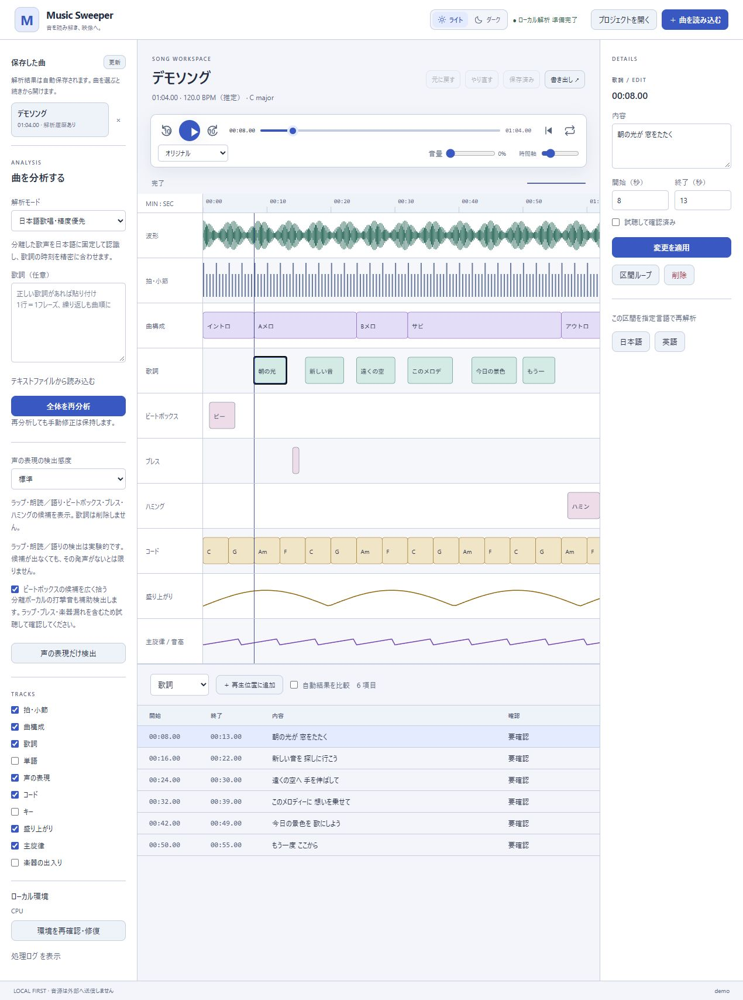
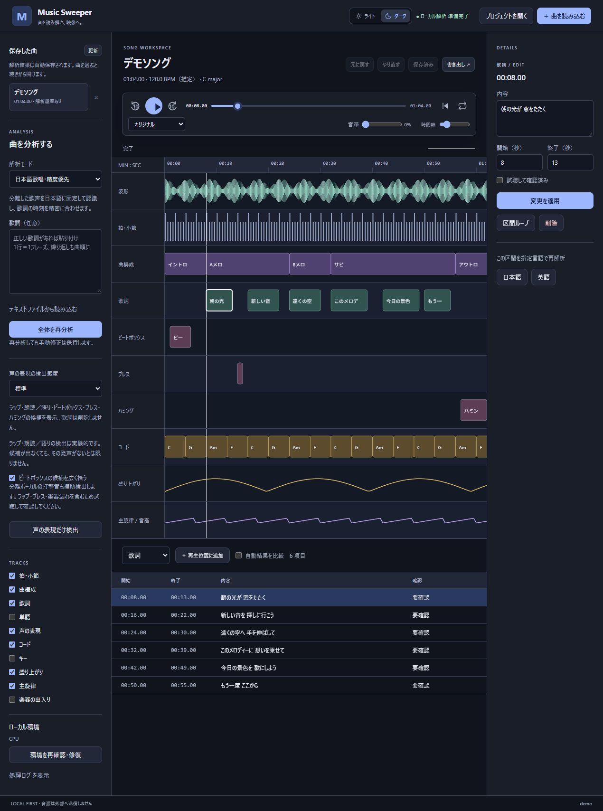

# 使い方

[READMEへ戻る](../README.md) · [出力JSONとプロジェクト形式](json-format.md) · [CLI・MCP](automation.md)

## 画面の見方

下の画像は架空の曲・歌詞・解析値を使ったブラウザーハーネスです。実曲や個人のファイルパスは含みません。音声再生とモデル推論は行いません。

左側で曲と解析モードを選び、中央の時間軸で波形・拍・歌詞・コード・声の表現を確認します。項目を選ぶと、右側で内容と開始・終了時刻を編集できます。上部のプレイヤーでシーク、音量、ループを操作します。

**ライトモード**



**ダークモード**



画像を更新する手順は[スクリーンショットの作成](screenshots.md)を参照してください。実際のデスクトップ画面は[MCP・CLIからも撮影](automation.md#アプリのスクリーンショット)できます。

## 起動

```powershell
# クローンしたリポジトリのルートで実行
npm run tauri:dev
```

開発環境の初回準備は[README](../README.md#開発環境の準備)を参照してください。解析環境とモデルは `.runtime/` に保存します。ビルド後の実行ファイルは `src-tauri/target/release/music-sweeper.exe`。アプリの「曲を読み込む」で音源を選び、解析モードを選択して「分析を開始」を押します。新しいプロジェクトはWindowsの「ドキュメント」内の `Music Sweeper/Projects/` に自動保存します。実際の保存先は画面下部に表示します。

## 機能

AI向けの[ヘッドレスCLI・MCP操作](automation.md)に対応しています。保存曲の取得、非同期解析、区間検索、短い音声の切り出し、差分付きの修正、書き出し、GUIで指定区間を開く操作を利用できます。GUIで開始した解析もアプリを閉じた後に継続します。中止する場合は終了前に「処理を中止」を押してください。

左側の「保存した曲」から、以前の解析結果と手修正を再分析せずに開けます。解析結果はプロジェクトへ自動保存されます。手修正は「変更を適用」して「修正を保存」で確定します。標準保存先の既存プロジェクトも一覧へ表示します。別の場所のデータは「プロジェクトを開く」で一度開くと、次回起動後も一覧に残ります。移動したフォルダーは再度開き直してください。音源だけでなくプロジェクトフォルダー全体を残しておく必要があります。

曲の横の「×」から解析データを削除できます。確認後に解析結果・分離音声・手修正・書き出しを削除し、一覧から取り除きます。元音源、プロジェクト内の原本コピー、再生用音声は残します。一覧から消した曲は「プロジェクトを開く」で再登録できますが、解析結果は復元できないため再分析が必要です。解析中は削除できません。

- 多言語歌唱、日本語歌唱・精度優先、インストの3モード。日本語モードは言語固定・beam10・ボーカル分離・WhisperX時刻合わせを使用。
- BPM・拍・小節頭、サビ等の構成候補、相対的な盛り上がり、歌詞行と単語相当の時刻、コード・キー、音高曲線。
- ボーカル / ドラム / ベース / その他の4分離音声を切り替えて試聴。音量から各パートの出入りを表示。
- 波形、シーク、ズーム、区間ループ。項目の追加・削除・修正・確認済み指定、Undo/Redo、BPMからの拍再配置。
- ヘッダーでライト／ダークを切り替え。初期値はダークで、選択したテーマを次回起動時にも保持します。
- 再生音量を0～100%で調整。音量は次回起動時にも保持します。音源や解析結果の音量は変更しません。
- 既知の歌詞を貼り付けるかUTF-8テキストから読み込み。歌詞行の区間を日本語/英語で再解析。
- 「声の表現」トラックにビートボックス・ブレス・ハミング・その他の非言語発声の候補を表示。分類・時刻の修正、区間ループ、確認済み指定に対応。
- 自動結果と手修正を分けて保存。再解析で手修正は消えません。「自動結果を比較」で元結果を表示できます。
- JSON / CSV / SRT をプロジェクトの `exports/` に出力。時刻未確定の歌詞はSRTから除外。
- 解析段階ごとに結果を保存。部分失敗・中止後も完了済みの結果を開けます。保存時に競合を検出し、ウィンドウ終了前には適用済みの修正を保存します。

編集欄に入力した内容は「変更を適用」で修正データになります。トラックを手修正した場合、再解析したそのトラックの結果は修正を解除するまで上書き表示されません。

## 声の表現を検出する

「ビートボックスの候補を広く拾う」は、分離ボーカルの連続する打撃音も拾う補助検出です。「ビートボックス候補」と表示し、通常のラップ・子音・ブレス・楽器漏れも含み得ます。正解率を示すモデルスコアは付けず、試聴して確認します。従来のモデル分類だけにするにはチェックを外してください。手修正がある場合、再検出後は「未追加の声の分類を取り込む」で未追加の補助候補を追加できます。

プロジェクトを開いて「声の表現だけ検出」を押すと、歌詞や拍などの結果を保持して候補を追加できます。全体の分析でも自動実行します。原曲と、利用できる場合は分離ボーカルを解析します。歌詞と声の表現は重ねて表示し、検出を理由に歌詞を削除しません。

「編集トラック」で「声の表現」を選び、候補をクリックして分類・時刻を修正します。ラップ、朗読・語りも検出対象です。タイムラインでは種類ごとに別の段へ表示し、同時に鳴る声も確認できます。モデルスコアと参照音声を詳細欄で表示します。スコアは正解率ではありません。感度を「候補を多めに拾う」にすると弱い候補も追加しますが、誤検出も増えます。

ラップはAudioSetのRapping、朗読・語りはNarration, monologueに基づく候補です。文学的な詩かどうかの判定ではありません。歌唱・ラップ・語りの境界には誤検出や見逃しがあり、候補同士の重複も許容します。言葉の認識は歌詞トラックで扱います。旧結果には新しい分類がないため「声の表現だけ検出」を実行してください。手修正済みの場合は「未追加の声の分類を取り込む」で、既存の修正を保持して追加できます（その分類を既に手修正している場合は「自動結果を比較」で確認）。

2秒の窓を0.5秒ずつ動かす分類のため、表示範囲は発声の厳密な開始・終了ではありません。息・歌声・楽器の取り違えや見逃しがあります。「その他」はうめき・唸り・すすり泣き・笑い声のモデル分類に基づき、「あー」「うー」やスキャットを網羅する自動判定ではありません。必要に応じて手動で追加・分類してください。全候補を「要確認」として保存します。

JSON/CSVには声の表現とモデルスコアを含め、SRTは歌詞だけを出力します。手修正した声の表現は再検出後も残るため、新しい推定を見るときは「自動結果を比較」を使います。旧プロジェクトもそのまま開けます。追加モデルが未準備と表示される場合は「環境を再確認・修復」を実行してください。

非言語音の自動文字起こしには未対応です。区間ループで試聴し、詳細の「内容」に「ブッ・ツク」「んー」「［息］」などを手入力できます。分類を変更しても入力済みの表記を保持し、JSON/CSVに出力します。「その他」と推定されたビートボックスも、声の分類から修正できます。

分類には [MIT AST AudioSetモデル](https://huggingface.co/MIT/ast-finetuned-audioset-10-10-0.4593) の固定リビジョンを使用します。初回取得後の推論はローカルで完結します。

## 推定の限界

コードの細かい変化が実際の和音変化とは限りません。BTCで原曲全体を分析しますが、短い誤推定やコードの揺れが残ります。以前の方式の結果をBTCへ更新するには、編集トラックでコードを選び「コード・キーだけ再推定」を実行してください。既存の手修正は保持します。

全自動結果を「要確認」として扱います。ラップ・語り・ビートボックス・長い間奏では歌詞の誤認識や欠落があります。日本語モードでも完全な歌詞復元を保証しません。正しい歌詞を指定し、区間を狭めて合わせ直す方法を用意しています。

日本語・英語には専用alignmentモデルを使います。他の言語はASRが返した時刻候補です。日本語の「単語」は文字相当の単位になる場合があります。時刻が見つからない歌詞は `null` とし、均等配分で埋めません。

BTCは7th等も扱いますが、正解率は未評価です。キーは曲全体の候補で、転調は区間を追加して修正します。主旋律は音高曲線のみで、MIDI出力はありません。ハモリや複数楽器が重なる箇所では主旋律を特定できない場合があります。盛り上がりは音量の相対変化であり、感情の判定ではありません。

## BTCでコードを分析する

コード推定はBTCのみを使用します。原曲全体を入力し、追加の平滑化は行いません。全体分析にも「コード・キーだけ再推定」にも同じ設定を使います。方式選択、方式別比較、従来の三和音推定、ChordNetは製品の解析経路から外しています。

以前の方式で保存した結果と手修正はそのまま開けます。旧結果を表示している場合はコード欄に案内を表示し、再推定すると新しいrunへBTCの結果を保存します。過去のrunと元の音源は保持します。手修正と最新の自動結果は「自動結果を比較」で確認でき、自動結果を採用する場合は「このトラックを自動結果へ戻す」を使います。

初回セットアップにBTCの準備を含めます。既存環境でBTCだけ未準備の場合は、左側の「コードモデルをセットアップ」を実行してください。開発環境では `npm run setup:chordmini` でも準備できます（Gitとuvが必要）。`MUSIC_SWEEPER_RUNTIME` で別の保存先を使用する場合は、アプリ内のセットアップ、または `scripts/setup-chordmini.ps1 -RuntimeRoot <保存先>` を使ってください。既存の解析環境と別の `.runtime/chordmini/venv` に導入します。

[ChordMini公式リポジトリ](https://github.com/ptnghia-j/ChordMini) のコミット `aa6e3a8d7b017f082fd2aaff9329d5c26af49c03` とBTC推論処理を使用します。公式CQT・チェックポイント統計による正規化・重複窓50%・logit統合で推論します。追加のHPSSやボーカル除去は行わず、kernel=1、短区間の削除は無効です。キーは従来どおり伴奏のクロマと調性プロファイルで推定します。

170クラスの元ラベル（`A:min7`など）をそのまま保存・表示します。`N`は和音なし、`X`は判定不能です。分数コードの識別には未対応。信頼度は出力に存在しないため追加しません。公式処理の時間分解能は約0.093秒で、曲末に最大1フレーム未満の未出力部分が残ります。短い誤推定やコードの揺れがあるため、試聴して確認してください。

各runの `chordmini/` に元の `.lab`、推論ログ、重み・設定・入力音声のSHA-256、正規化統計、推論パラメーターを保存します。セットアップ後のソース・重み変更、重みの不一致、空白や重複のある区間出力は失敗として扱い、解析中の通信は禁止します。モデルをインストーラーやGitへ同梱しません。モデル重みの商用利用・再配布条件は未確認です。

保存フォルダーの構成と書き出すJSONの詳細は、[出力JSONとプロジェクト形式](json-format.md)を参照してください。
